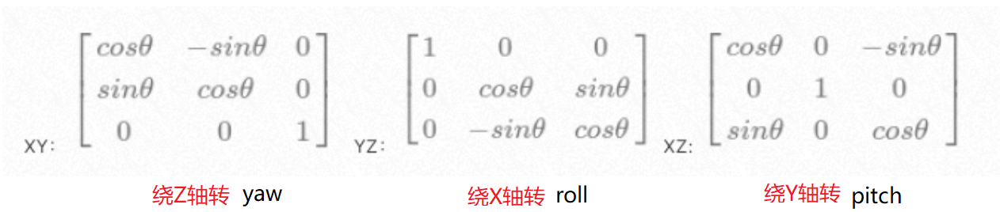

# sample

All sample code
DemoViewer.java   原作者的程序, 正六面体, 全白
MyDemoViewer.java 我根据英文文章写的程序,完全工作, 彩色球体
Engine3D.java     我根据中文文章写的程序,没有完成

## DemoViewer.java
1. [How to create your own simple 3D render engine in pure Java](http://blog.rogach.org/2015/08/how-to-create-your-own-simple-3d-render.html)
2. [纯Java构造一个简单的3D渲染引擎](https://mp.weixin.qq.com/s/mnUcffuh0nqhuVXvo9eGLw)
3. `javac -encoding UTF-8 MyDemoViewer.java`
4. `java MyDemoViewer`

## 旋转矩阵
1. [旋转矩阵](https://zh.wikipedia.org/wiki/%E6%97%8B%E8%BD%AC%E7%9F%A9%E9%98%B5)
2. 旋转矩阵的逆矩阵是它的转置矩阵
3. 表现形式（1）: 绕固定坐标系x, y 和 z轴的旋转
4. 表现形式（2）: 绕一个单位向量的转角, 四元数表示
5. 表现形式（3）: 欧拉角表示, 绕自身坐标系x, y 和 z轴的旋转

## 坐标系
1. 左手系: X 坐标表示左右方向的转动(绕Y轴转动)，Y 表示屏幕上的上下转动(绕X轴转动)，Z 表示深度（因此 Z 轴垂直于您的屏幕）。正 Z 表示“朝向观察者”
2. 因为是左手系，先T1转再T2转, 计算顺序是vT1T2

## 转动角度正负
1. 迎着Z轴的箭头看, 逆时针旋转为正角 
2. 右手笛卡尔坐标系的 x, y 和 z轴的旋转分别叫做 roll, pitch 和 yaw 旋转

## 绕XYZ轴转动矩阵

