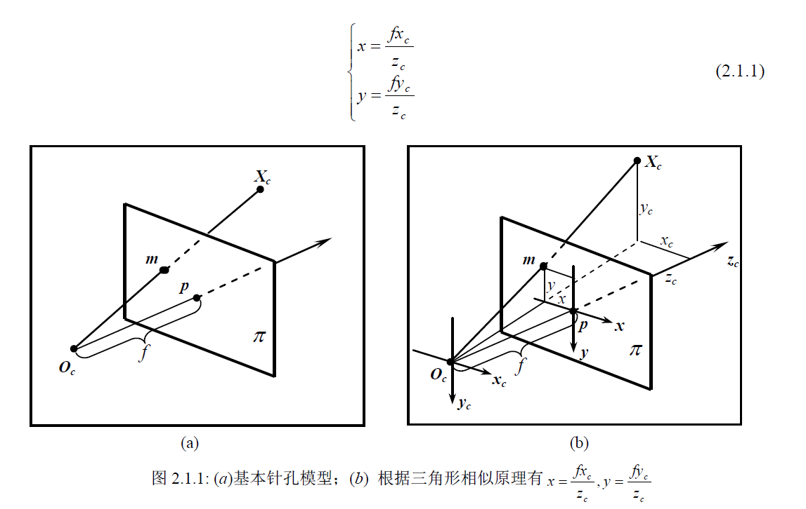
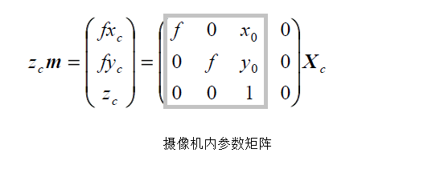
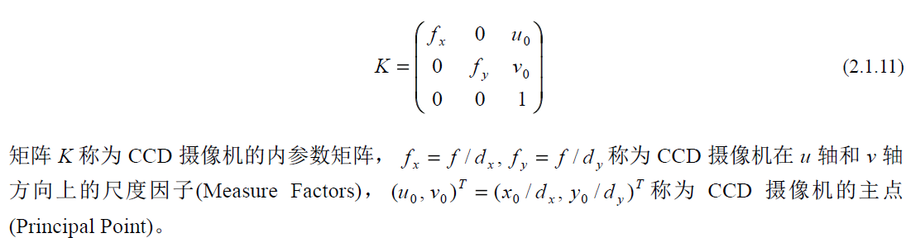
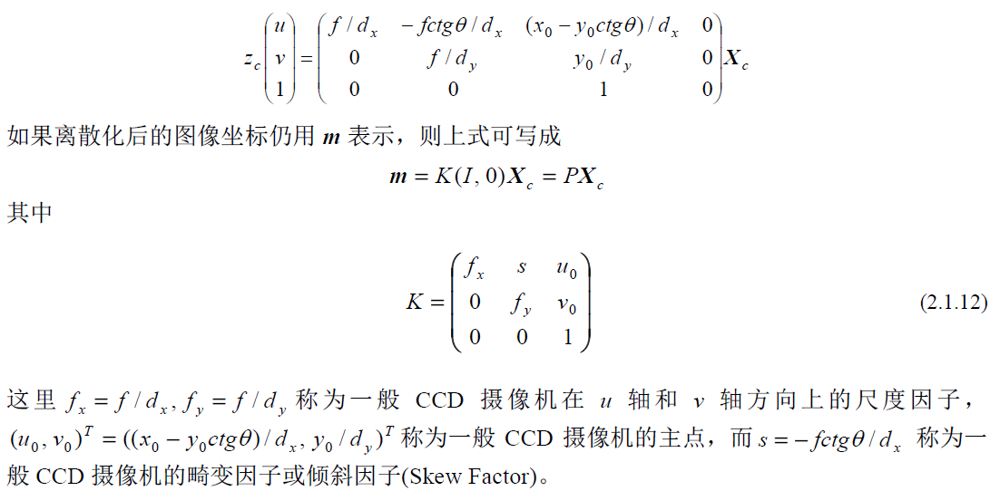

# 计算机视觉讲义
[计算机视觉讲义](http://vision.ia.ac.cn/zh/teaching/index.html)

## 旋转矩阵
1. [旋转矩阵](https://zh.wikipedia.org/wiki/%E6%97%8B%E8%BD%AC%E7%9F%A9%E9%98%B5)
2. 旋转矩阵的逆矩阵是它的转置矩阵
3. 表现形式（1）: 绕固定坐标系x, y 和 z轴的旋转，左乘
4. 表现形式（2）: 绕一个单位向量的转角, 四元数表示
5. 表现形式（3）: 欧拉角表示, 绕自身坐标系x, y 和 z轴的旋转, ，右乘

## 坐标系

## 转动角度正负
1. 迎着转动轴的箭头看, 逆时针旋转为正角 
2. 右手笛卡尔坐标系的 x, y 和 z轴的旋转分别叫做 roll, pitch 和 yaw 旋转

## 附录一 射影几何初步
1. 直线: (a b c), 点(xt, yt, t)^T^
2. 齐次坐标(Homogenous Coordinate), 射影平面(Projective Plane), 叉积(Cross Product), 交比(Cross Ratio), 调和共轭(Hamonic Conjugate), 
3. 射影平面 = 欧氏平面 + 无穷远直线
4. 小孔成像/针孔相机焦点就是小孔, 成像是在焦点后面
5. 凸透镜 -> 焦点 -> 像
6. 凹透镜:   虚像 -> 虚焦点 -> 凹透镜
7. 投影   -> 投像 -> 焦点,  图象平面是在焦点前, 焦距, 
8. Page5

## 附录二 摄像机成像模型
1. 摄像机模型: 基本针孔模型, 中心投影, 中心/光心/焦点, 焦距(Focal Length)，光轴/主轴(Principal Axis), 主点(Principal Point)
2. 立摄像机(欧氏)坐标系, 像平面(欧氏)坐标系, 
3. 摄像机矩阵(Camera Matrix)-世界坐标系和图象坐标系的转换: ImageFrame = P * WorldFrame_XYZ
4. 主点不在图像中心: 图像中心 / 图像的左上角作为图像坐标系的原点
5. 观察者的位置和方向 = 照相人的
6. 摄像机内参数矩阵(Intrinsic Parameters Matrix), 
7. 
8. 平行四边形CCD: 畸变因子或倾斜因子(Skew Factor), 
9. 摄像机矩阵的世界坐标系(World System), 摄像机的外参数矩阵(Extrinsic Parameters Matrix)
10. 空间点在一个固定位置上的摄像机下的图像只与内参数矩阵有关，而与世界坐标系选择无关。也就是说，不论如何选择世界坐标系，空间点在像平面上的投影点的位置是不变的
11. 摄像机矩阵元素的几何意义
12. 2.1.3 摄像机矩阵的估计, P10

## 第一章：计算机视觉简介：历史、现状和发展趋势
1. 研究内容: 物体视觉（object vision）, 空间视觉（spatial vision）
2. 历程： 
    1. 马尔计算视觉(计算理论, 表达和算法, 算法实现)， 
    2. 主动和目的视觉，
    3. 多视几何
    4. 分层三维重建: 图象 -> 射影空间 -> 仿射空间 -> 欧氏空间
    5. 摄像机自标定: 成像模型选择, 模型参数估计
    6. 基于学习的视觉: 流形学习, 深度学习

## 第二章：生物视觉中的物体识别通道简介
## 第三章：猴子与人视觉皮层中的神经物体表达及其基于DCNN的建模
## 第四章：基于图像的三维重建
## 3D 机器视觉基础